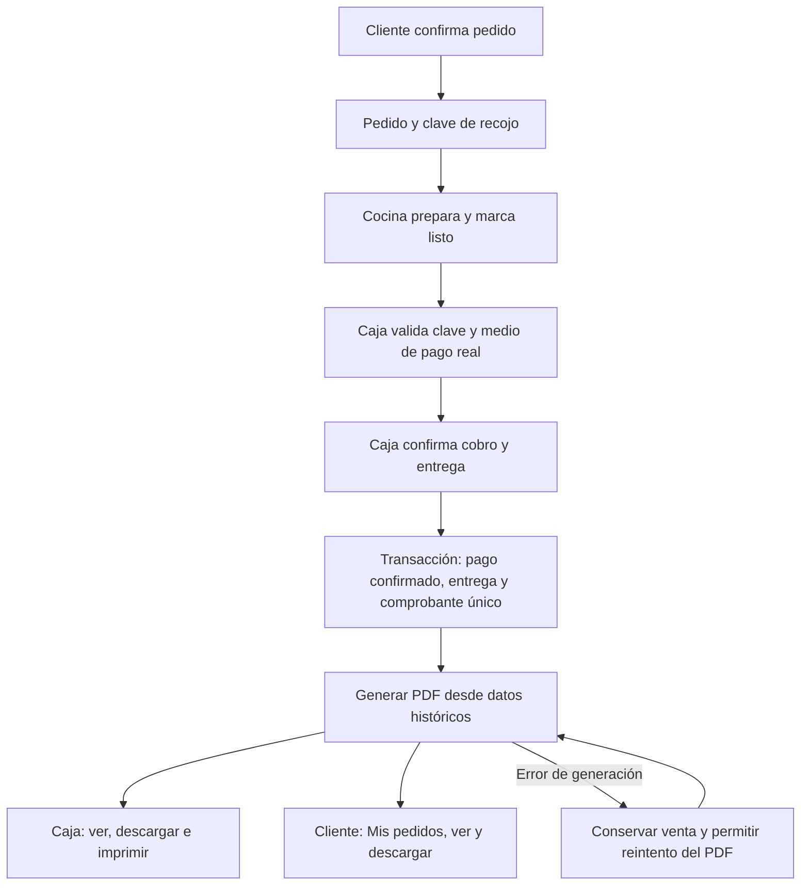

# Plan de acción: comprobante de venta y descarga en PDF

Fecha: 8 de septiembre de 2026. Proyecto: Las Musas, rama Ramirez.
Estado: implementado el 9 de septiembre de 2026. Este documento conserva las decisiones y criterios de aceptación.

## 1. Conclusión

Es viable ampliar lo que ya existe. El sistema ya registra un comprobante al entregar el pedido y dispone de una vista administrativa con botón Imprimir. Falta ofrecer un PDF descargable, acceso para el cliente y una confirmación explícita del cobro en caja.

Propuesta: una venta genera un solo comprobante, con un número y datos históricos fijos. Cliente y caja consultan ese mismo registro y descargan el mismo documento. Descargar, reimprimir o reintentar no vuelve a cobrar ni emite otro comprobante.

Se mantiene el funcionamiento del proyecto: retiro en tienda, pago presencial o validación manual de Yape/Plin, sin pasarela de pago ni integración SUNAT en esta etapa. Caja será una función de los roles administrador y superusuario existentes; no hace falta crear un rol nuevo para esta entrega.

## 2. Flujo actual revisado

| Paso | Comportamiento actual | Código principal |
| --- | --- | --- |
| Elegir productos | El cliente inicia sesión y prepara su carrito; cantidades y selecciones se conservan en el navegador. | `static/js/carrito.js`, `controllers/cliente.py` |
| Confirmar pedido | El servidor vuelve a consultar productos y precios, incluye adicionales y valida datos, stock y franja de recojo. | `controllers/cliente.py`, `model/Pedido.py` |
| Registrar pedido | Guarda cabecera y detalle, descuenta stock y entrega una clave de cuatro dígitos. Todavía no emite el comprobante. | `Pedido.crear_pedido_completo` |
| Preparación | El panel permite pasar por recibido, en preparación y listo. El cliente consulta el seguimiento. | `controllers/admin_pedidos.py`, `templates/client/mis-pedidos.html` |
| Entrega | Caja introduce la clave; se marca como recogido y se emite el comprobante dentro de la misma transacción. | `Pedido.marcar_recogido`, `Pedido._emitir_comprobante` |
| Consulta de venta | Caja consulta número, detalle y totales. El botón Imprimir abre el diálogo del navegador. | `controllers/admin_ventas.py`, `templates/admin/ventas/detalle_comprobante.html` |

La clave confirma el pedido que se entrega; por sí sola no demuestra que se haya cobrado. La pantalla de pedido confirmado tampoco es un comprobante de pago.

### Hallazgos que condicionan la mejora

1. **El pago real no queda identificado con suficiente precisión.** Se guarda la elección digital/presencial. El detalle muestra “Yape / Plin” o “Efectivo”, aunque el pago presencial también admite tarjeta. Caja debe registrar el medio efectivamente utilizado.
2. **Falta una confirmación expresa del cobro.** La operación actual presume que entregar equivale a haber cobrado. Se propone hacer explícito ese paso.
3. **La entrega no exige “listo” en el servidor.** `marcar_recogido` revisa clave y estado activo, pero no `estadoPrep`. El nuevo flujo debe exigir pedido listo antes de cobrar y entregar.
4. **Ya hay protección parcial frente a duplicados.** El UPDATE condicionado evita repetir la entrega y los tests verifican un segundo intento secuencial. Falta reforzar la unicidad en la base y probar solicitudes concurrentes.
5. **El documento depende de datos externos al comprobante.** Nombres, teléfono, forma de pago y tipo se consultan desde pedido/usuario. Deben conservarse al emitir para que una descarga futura no cambie la historia de la venta.
6. **Los importes usan FLOAT.** Conviene usar `Decimal` en el cálculo y columnas `DECIMAL` para importes, con una política única de redondeo a céntimos.
7. **Se agrupan líneas por producto y nombre.** Dos hamburguesas con diferentes adicionales pueden terminar con un precio unitario promedio. El PDF debe preservar las líneas con sus configuraciones y precios cobrados.
8. **No existe una descarga PDF ni una consulta de comprobantes para el cliente.** Deben añadirse con autorización por propietario.
9. **No se encontró un recurso de logo en los archivos actuales de `static/img`.** Hay una marca tipográfica en HTML. El diseño final requiere incorporar el logo oficial del negocio; no se considerará definitivo un marcador provisional.

La interfaz actual usa “Boleta electrónica”, pero no hay un sistema de emisión electrónica integrado. Esta etapa debe presentarse como **comprobante interno de venta / nota de venta** y corregir las etiquetas que prometen emisión electrónica. La emisión tributaria electrónica exige un alcance distinto; un PDF por sí solo no lo implementa. Referencia: [SUNAT, Boleta de Venta Electrónica](https://cpe.sunat.gob.pe/tipos_de_comprobantes/boleta).

## 3. Flujo propuesto

**Caja:** selecciona el pedido listo, ingresa la clave, verifica el importe y elige Efectivo, Tarjeta, Yape o Plin. Para pagos digitales comprueba manualmente el abono. Pulsa **Confirmar cobro y entregar**, revisa el modal de confirmación existente y accede al comprobante. Debe conservarse una acción clara para volver a pedidos.

**Cliente:** antes del cobro ve “El comprobante estará disponible al pagar y recoger”. Después aparecen **Ver comprobante** y **Descargar PDF** en Mis pedidos y en el detalle del pedido. El seguimiento existente debe actualizar esos botones cuando se confirma la entrega, sin obligar a iniciar sesión otra vez.

**Administración:** desde Ventas se mantiene la consulta y se añaden Descargar PDF e Imprimir. Cliente y caja obtienen los mismos importes, líneas, número y fecha; los controles internos de caja no forman parte del PDF del cliente.

## 4. Diseño del PDF

Formato inicial recomendado: **A4 vertical**, apto para guardar, compartir y usar en impresoras habituales. Un ticket térmico de 80 mm puede añadirse como formato posterior.

| Zona | Contenido y presentación |
| --- | --- |
| Cabecera | Logo oficial a la izquierda, sin deformarlo; marca y dirección de Chiclayo debajo. Tipo de documento, número y fecha/hora a la derecha. |
| Datos de operación | Bloques alineados de cliente/receptor, pedido y pago confirmado. Fecha/hora de Perú y moneda S/. |
| Detalle | Descripción, cantidad, precio unitario e importe. Descripciones a la izquierda; números a la derecha. Adicionales debajo de cada producto si corresponden. |
| Totales | Subtotal e IGV según la lógica vigente, total destacado e importe en letras. Nunca sumar el IGV por segunda vez. |
| Pie | Mensaje de agradecimiento, identificación como comprobante interno y numeración de páginas. |

Especificaciones visuales:

- Márgenes de 18 mm, columnas consistentes y separación regular entre bloques.
- Fondo blanco, texto carbón y acentos discretos en el color brasa del proyecto.
- Tipografía legible de 10–11 puntos en contenido; título y total con mayor jerarquía.
- Logo con proporción original y calidad suficiente para impresión; fuente local con soporte para tildes, ñ y símbolos monetarios.
- Sin sidebar, botones, fotos de productos ni instrucciones privadas de cocina dentro del PDF.
- Nombres largos y adicionales deben ajustar su altura; no reducir toda la página hasta volverla ilegible.
- Para varias páginas: repetir cabecera de tabla, evitar cortes incómodos y mantener el bloque de totales junto.
- Nombre de descarga estable, por ejemplo `Las-Musas-Comprobante-NV01-00000042.pdf`.

## 5. Implementación por etapas

### Etapa 1: cerrar emisión y cobro correctamente

- Ampliar el formulario de caja con medio real de pago y confirmación del cobro.
- Mantener CSRF y el modal `MusaConfirm`.
- Validar en servidor: sesión autorizada, pedido listo, clave correcta, pago válido y ausencia de cancelación/no-show/entrega previa.
- Registrar quién confirmó el cobro y la fecha/hora de Perú.
- Conservar entrega y emisión dentro de una transacción; si falla la persistencia, no dejar una venta registrada a medias.

**Resultado verificable:** un pedido pagado y entregado tiene un único comprobante; un pedido pendiente, cancelado o no recogido no genera uno.

### Etapa 2: datos históricos y migración

- Crear una migración incremental (por ejemplo, `012_comprobantes_pdf.sql`) y actualizar `sql.sql` para instalaciones nuevas. Hacer respaldo antes; no reimportar `sql.sql` sobre la base existente.
- Conservar en `comprobante` el nombre/documento del receptor, datos del negocio, tipo de documento, medio de pago, operador y fecha de cobro. Mantener `idUsuario` para identificar al dueño aunque recoja otra persona.
- Preservar las líneas originales, precios y adicionales. Revisar la clave actual de `detalleComprobante` para admitir el mismo producto en líneas distintas; utilizar un identificador de línea.
- Agregar `UNIQUE(idPedido)` y unicidad del número. Revisar previamente duplicados y ajustar el valor provisional `PENDIENTE` antes de imponer unicidad en la numeración.
- Aplicar `Decimal` y `DECIMAL` de forma coherente en los importes involucrados. Comparar totales históricos antes/después y definir el redondeo por línea y del IGV.
- Para registros antiguos, conservar número e importes y marcar como no registrado cualquier medio de pago u operador que no pueda reconstruirse. No inventar datos ni reemitir números históricos.

**Resultado verificable:** cambiar después la carta, el perfil, el logo o la dirección no altera un comprobante ya emitido.

### Etapa 3: generador PDF único

- Añadir **ReportLab**, fijando una versión compatible con Python 3.10 tras probarla en el entorno del proyecto.
- Crear un servicio como `services/comprobante_pdf.py` que reciba un comprobante autorizado con sus datos históricos y genere el documento.
- Usar Platypus para tablas, texto, logo y paginación. Su soporte de tablas con cabeceras repetidas encaja con pedidos largos: [documentación de ReportLab](https://docs.reportlab.com/reportlab/userguide/ch7_tables/).
- Incorporar el logo oficial y las fuentes como recursos locales versionados; evitar depender de una descarga externa en cada emisión.
- Generar el PDF después del commit de la venta. Un fallo de archivo no debe provocar otro cobro ni otra emisión.
- Guardar el PDF en almacenamiento privado, fuera de `static` y excluido de Git; escritura atómica y bloqueo por comprobante para descargas simultáneas. Conservar versión de plantilla/logo y hash del archivo.
- Reutilizar el archivo en descargas posteriores. Si falta o falló su creación, regenerarlo desde los datos y recursos históricos, manteniendo su número.

**Resultado verificable:** ambos perfiles descargan el mismo documento, incluso tras reintentos.

### Etapa 4: acceso de cliente y caja

Rutas propuestas, ajustables al estilo existente:

| Ruta | Acceso |
| --- | --- |
| `GET /mis-pedidos/<idPedido>/comprobante` | Cliente autenticado dueño del pedido. |
| `GET /mis-pedidos/<idPedido>/comprobante/pdf` | El mismo dueño; descarga del PDF emitido. |
| Detalle administrativo ya existente | Administrador o superusuario que opera caja. |
| `GET /admin/ventas/<idComprobante>/pdf` | Administrador o superusuario autorizado. |

- Compartir consulta y generador; no duplicar cálculos entre cliente y administrador.
- Comprobar propiedad del pedido en servidor, incluso si alguien cambia manualmente el ID de la URL. La clave de cuatro dígitos no es una autorización de descarga.
- Las rutas GET solo consultan o generan la representación del registro existente; nunca cobran ni emiten una venta nueva.
- Responder con `application/pdf`, `Content-Disposition: attachment` y caché privada/no-store. No revelar rutas físicas ni publicar documentos mediante enlaces estáticos.
- Conservar la acción Imprimir y añadir Descargar PDF en Ventas; integrar los botones y su actualización en Mis pedidos.

**Resultado verificable:** cliente A no puede abrir el comprobante de cliente B y caja puede consultar las ventas autorizadas.

### Etapa 5: pruebas y revisión visual

Pruebas funcionales y de seguridad:

- Pedido creado/listo sin cobro: no hay comprobante disponible.
- Cobro y entrega correctos: registro único, número y PDF disponibles para ambos perfiles.
- Clave errónea, cancelación, no-show o estado no listo: no se emite.
- Doble clic y dos solicitudes simultáneas: una sola emisión y un solo archivo final.
- Error SQL: operación revertida. Error PDF: venta conservada y descarga recuperable sin duplicar.
- Propiedad del cliente, sesión cerrada y permisos del panel.
- Coincidencia de líneas, cantidades, precios, adicionales, subtotal, IGV y total entre venta, vista y PDF.
- Pago con tarjeta no aparece como efectivo; pagos históricos no identificados se muestran sin inferencias.
- Cambios posteriores de productos, perfiles y sede no cambian el comprobante anterior.

Pruebas del documento:

- Verificar que sea un PDF válido, con texto seleccionable, logo y fuente correctos.
- Ejemplos de 1 producto, muchos productos, descripciones extensas, adicionales, tildes y montos grandes.
- Renderizar todas las páginas a PNG con Poppler y revisarlas visualmente: simetría, márgenes, cortes, alineación de números, total y pie. Extraer texto no sustituye esta revisión.
- Probar la descarga e impresión desde cliente y caja, en escritorio y móvil.

### Etapa 6: puesta en marcha local

- Aplicar la migración con respaldo, instalar la dependencia y comprobar permisos del almacenamiento privado.
- Ejecutar el flujo completo en una base de prueba: pedido, preparación, cobro/entrega, consulta y descarga por cliente y caja.
- Ejecutar la suite del proyecto, revisar el PDF renderizado y documentar el uso para caja en la bitácora.
- Mantener los cambios sobre Ramirez o una rama derivada; no publicar ni fusionar a main como parte de este plan.

## 6. Criterios de terminación

La mejora estará completa cuando caja confirme el cobro y entregue el pedido, se registre un comprobante único y ambos perfiles puedan descargar el mismo PDF con logo, datos correctos y diseño revisado. Ninguna descarga podrá emitir otra venta ni exponer documentos ajenos.

Antes de cerrar el diseño se necesita el archivo del logo oficial. Para estimar la implementación se propone A4, marca Las Musas - Chiclayo, operación de caja con los roles existentes y documento interno. La incorporación de emisión SUNAT, impresora térmica, rol cajero independiente o envío automático por correo/WhatsApp queda fuera de esta primera entrega.

## 7. Evidencia de la revisión

- Revisión estática de checkout, emisión, entrega, historial, ventas, esquema SQL, plantillas y recursos de marca.
- Ejecución de `tests/test_pedido_flujo.py` y `tests/test_rutas.py` en una base temporal: **27 pruebas aprobadas**.
- Estas pruebas comprueban el comportamiento actual; no validan la descarga PDF propuesta, que todavía debe implementarse.
- No se modificó la lógica de la aplicación ni la base de trabajo durante este análisis. Este archivo y la entrada de bitácora documentan el plan.
